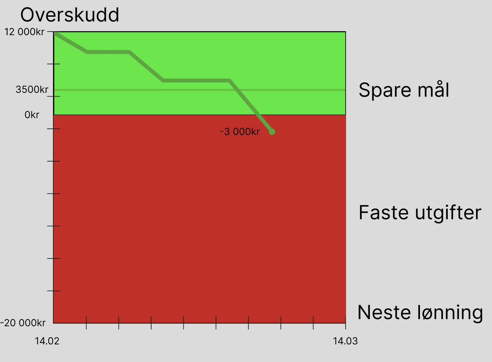
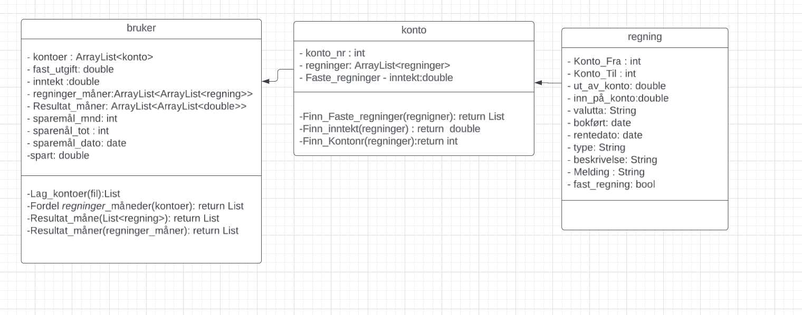

Dette prosjektet har som mål å utvikle en grafisk representasjon som på en enkel og intuitiv måte gir oversikt over økonomisk forbruk i løpet av en måned.

Å ha klar oversikt over økonomiske disposisjoner kan være utfordrende, spesielt før alle faste utgifter er betalt. Det kan være vanskelig å avgjøre om man har overskredet sitt budsjett for måneden. Situasjonen kompliseres ytterligere dersom overforbruket dekkes gjennom lån, da dette kan skjule det reelle økonomiske underskuddet. Derfor er det ønskelig å lage en graf som umiddelbart gir et klart bilde av økonomisk situasjon ved første øyekast.

I denne grafen representerer x-aksen dagene i måneden, mens y-aksen viser inntekten for måneden. Y-aksen er segmentert slik at den røde delen indikerer de forventede faste utgiftene. Dette visuelle verktøyet vil dermed gi brukeren en umiddelbar forståelse av økonomisk status, slik at man lettere kan se om man er i ferd med å gå i minus, og eventuelt ta nødvendige tiltak.

første prototype for classediagramet

